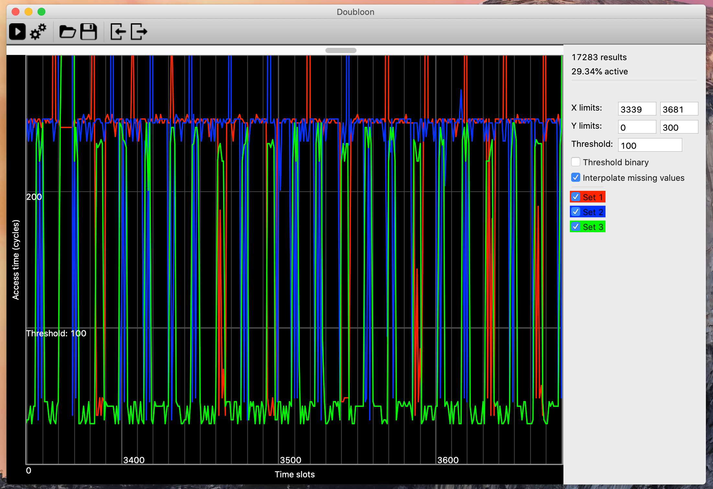

# Introduction

Doubloon is a a GUI tool for conducting CPU cache side-channel attack. It provides an interface for quickly configuring and conducting attacks and visualisations to assist in attack analysis. Currently Doubloon best supports `Flush+Reload` attacks by using Mastik's `FR-trace` utility. 

# User Interface

Doubloon is focused around a main window.



The toolbar along the top provides the main functionality of the program.

- Run/Stop: Starts and attack or stops it once it is currently running
- Config: Opens the config window allowing the user to configure an attack
- Load: Load a previously saved configuration with results from file
- Save: Save their configuration and results to a file
- Import: Load results only from a separate file
- Export: Save results only to a file

The central view provides a graph of the attack results. This presents a line graph with time slots along the X axis and cycles along the Y axis. A set of lines represent the results.

Right of the graph is the graph properties. This presents some information about the results along with options for changing the graph

- X limits: The range of values along the X axis of the graph
- Y limits: The range of values along the Y axis of the graph
- Threshold: Number of cycles that should separate memory and cache accesses
- Threshold binary: Shows results as only being either above or below threshold
- Interpolate missing values: Draws a line across missing results
- Set toggle: Choose to display each set of results or not.

# Attack configuration

The 'Run' button will start an attack and visualise the results once it is complete. However, an attack needs to be configured first. The 'Config' option next to the 'Run' button will open a new window that allows the attack to be configured. This window can remain open allows a user to quickly edit the attack parameters and immediately run the attack again.

## General

This option is for any program. The user simply needs to provide the absolute path to the program or command they wish to run and the arguments for it separated by spaces. Any custom program should stdout a space and newline separated list of times (see 'Import/Export data' section for details).

## FR-trace

This option is for with Mastik's FR-trace program. This option is simpler to configure.

- FR-trace program: Absolute path or command to use Mastik's FR-trace program. Defaults to 'FR-trace' and should be found if installed.
- Monitor locations: Locations to monitor in victim program and will be evicted from cache and measured, seperated by spaces. Example locations are `symbol+64` for byte offset on symbol or `file.c:80` for line number in file (only on linux). 
- Evict locations: Locations to evict from cache but not measure. Same format at monitor locations.
- PDA locations: Locations to perform a performance degredation attack on.
- Slot length: Time in cycles to take a sample.
- Max samples: Maximum number of samples to take in attack.
- Threshold: Threshold between memory and cache acceses in cycles.
- Idle count: Number of idle time slots before attack will be ended early. Set to 0 to not stop until maximum samples are taken.
- PDA count: How much to impact each PDA location. 

## Common

Some parameters are common between all attacks.
- Run victim program: Execute a victim program automatically when the attack is ran.
- Victim program: Specify the victim program or command to be executed.
- Victim arguments: Arguments to be supplied to the victim program

An attack can be run on a remote computer. This is currently an experimental feature.
- Run remotely (SSH): Execute the attack and victim programs remotely through SSH
- SSH hostname: Remote host to connect to
- SSH port: Port of remote host to connect to
- SSH username: User to connect as
- SSH password: Password of user to connect as (NOTE: password is not saved to disk but is in memory, use at own risk)

# Graph shortcuts

The graph can be navigated in a number of ways. 
- Click and drag zoom: Click and drag over the graph to select a horizontal region. On release the newly selected area will be zoomed in to.
- Scroll bar: Use the scroll bar along the top to scroll and navigate through the results.
- Arrow keys: Keyboard arrow keys can be used to zoom in and out, and pan the graph selection. 
- Properties: The X-limits can always be adjusted in the properties section next to the graph to change the section.

# Import/Export data

Doubloon can visualise data from an external source or export results in a general format. This format consists of several lines. Each line has a series of integers separated by spaces. If an integer is 0, the data is assumed to be missing. Each line represents a sample and each column represents a monitored location or set. Data can be imported in this format and will be exported in it. An example of this format looks like this.

```
# This is a comment and will be ignored
274 250 53 
271 247 30 
265 250 33 
271 33 30 
0 0 0
271 56 250 
268 250 235 
271 33 250 
...
```